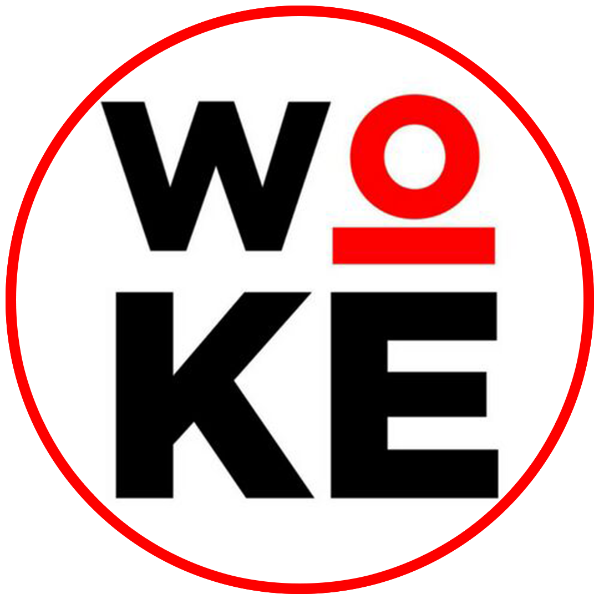
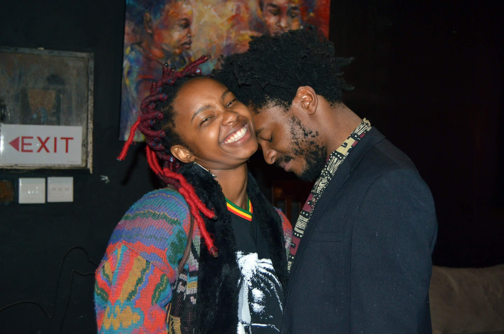
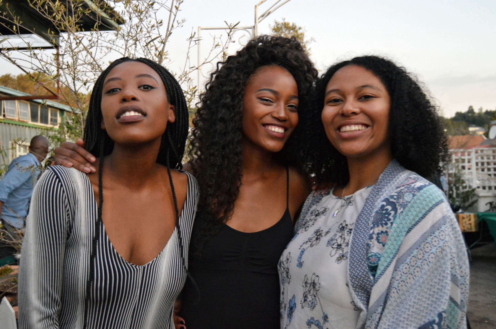
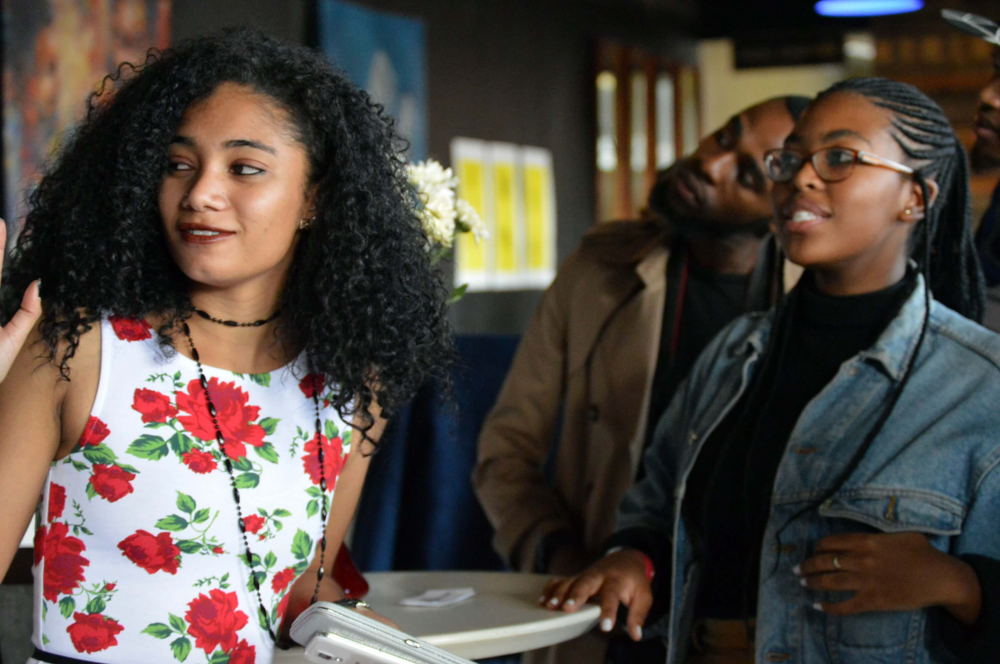
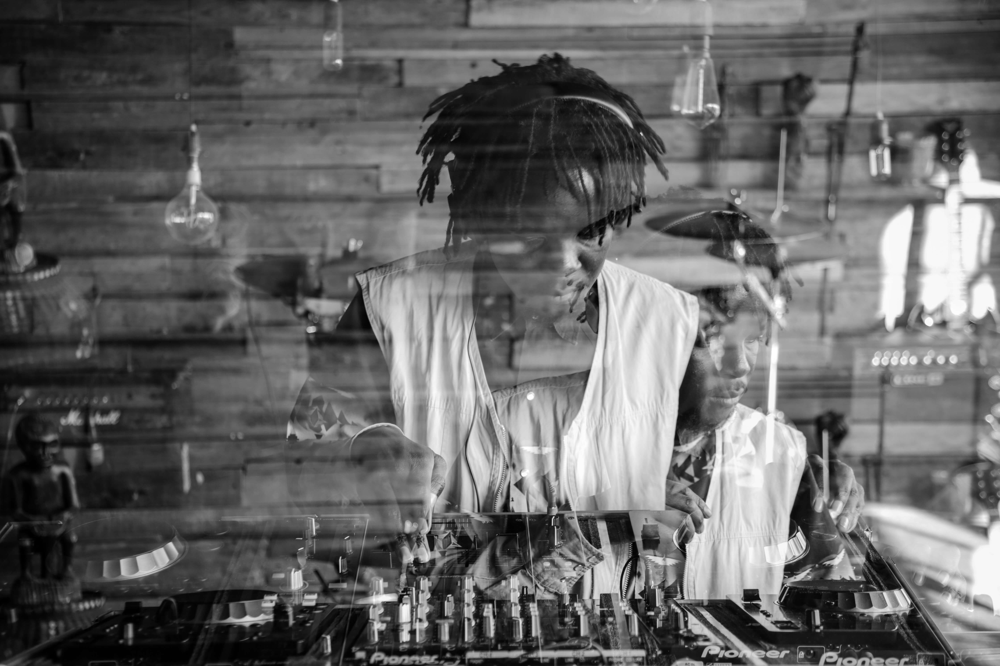

LOVE IS THE HIGHEST\
VIBRATION {.woke-heading}
====================

-   [WORK](#work)
-   [GALLERY](#gallery)
-   [ALTERNATIV](alternativ.html)

###### ABOUT WOKE ARTS {.woke-subheading-section}

PASSIONATE\
MARKETING EXPERTS {.heading}
-----------------

A community, we are about inclusivity and bringing diverse elements
together. We've expressed that through intersecting creative disciplines
and continuously working with marginalized groups in our staff and
events, making shared learning accessible and giving back to the
 community.\
‍\
We bring diverse elements together by working with various creative
crafts and this has trained us to bring together diverse expertise for
one goal.

[OUR APPROACH](#approach)

###### OUR APPROACH {.woke-subheading-section}

OUR ANALYTICAL\
APPROACH {.heading}
---------------

Our service includes a comprehensive consult to help identify gaps and
opportunities, and results in a comprehensive report that includes a
project plan with timelines a cost analysis. Our individualized plans
are made up of quality services that will help you get there quickly and
smoothly.

[OUR RANGE](#range)

###### OUR RANGE OF WORK {.woke-subheading-section}

INDUSTRY WIDE\
SUCCESS {.heading}
--------------

We work with a large number of clients from various industries,
including:\
‍\
- Governmental \
- Festivals and Events Technology\
- Retail and Malls\
- Finance/Banking\
- Restaurant\
\
Our creatives and marketing experts are ready assist you in developing
campaigns that drive your business.

[OUR GALLERY](#gallery)

OUR GALLERY {.heading-2}
-----------

Copyright © 2020 Woke Arts Holdings. All rights reserved.
